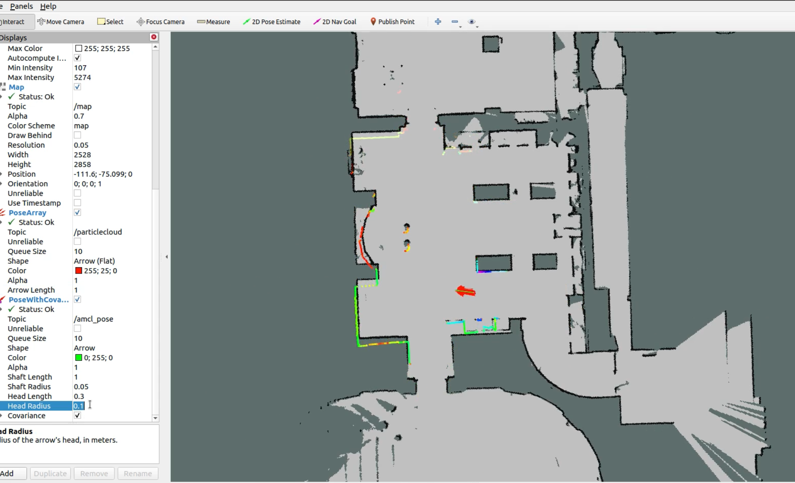
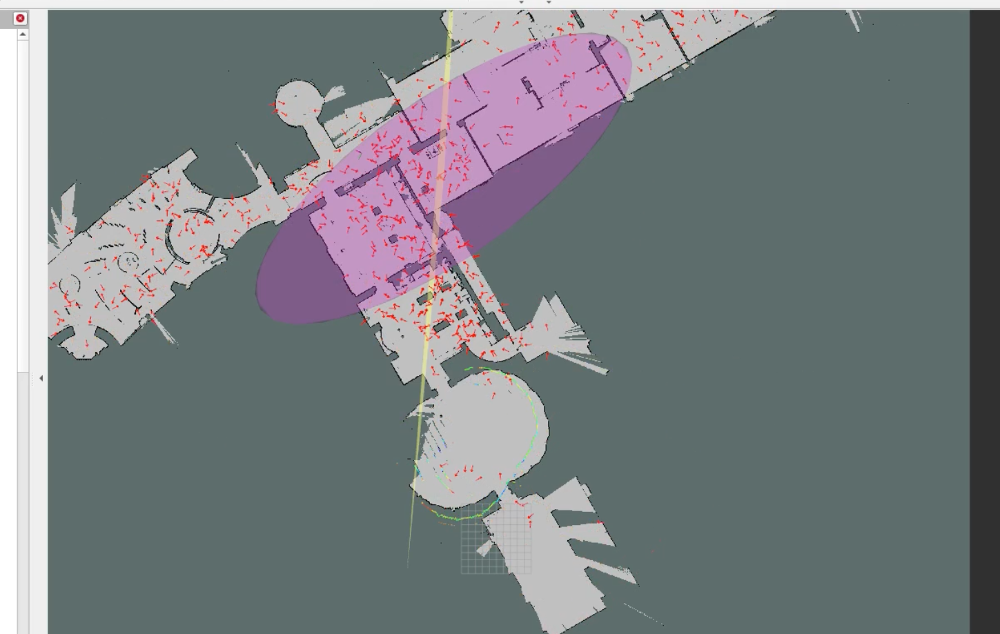
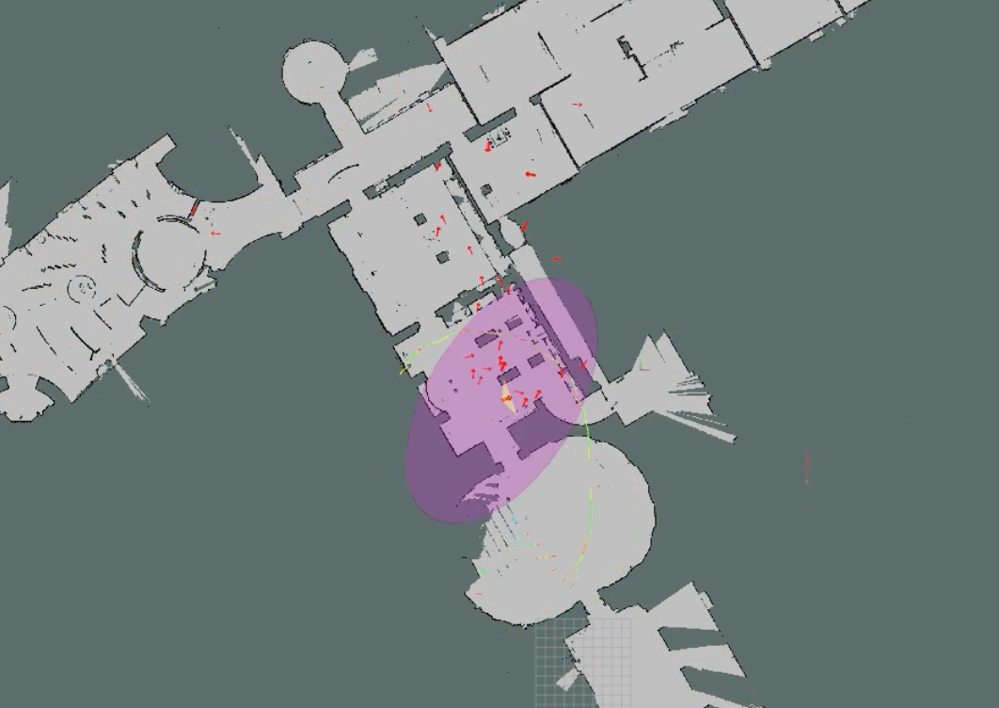
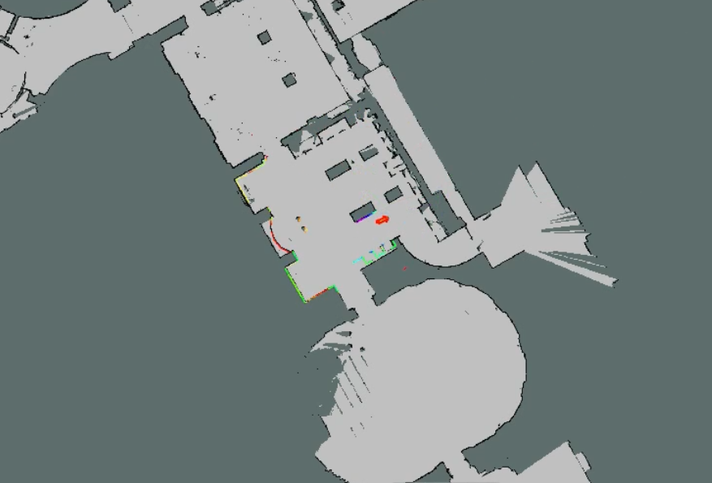

# ROS AMCL 定位模块测试


## Install and Build

clone 一下 ros-navigation 的包以及测试文件，编译工作空间

```bash
mkdir -p catkin_ws/src
cd catkin_ws/src
git clone https://github.com/Dangko/ROS_AMCL.git
cd ..
catkin_make
```


## Run

这里我提前跑了 cartographer ，保存了建好的地图和部分数据集，分别在目录 amcl 包里的 `map` 和 `rosbag` 下


加载地图前，注意修改  `map` 中 yaml 文件中 image 的路径：

```yaml
image: <your path>/catkin_ws/src/navigationl/amcl/map/mymap1_ros.pgm
resolution: 0.05
origin: [-111.603, -75.0987, 0.0]
negate: 0
occupied_thresh: 0.65
free_thresh: 0.196
```

加载地图并运行 amcl 节点：

```bash
source devel/setup.zsh
roslaunch amcl amcl_omni.launch
```

如果地图没加载成功，可能是因为 `use_simtime` 被设置成了 `true`，在终端执行以下命令修改成 `false` 就行：

```bash
rosparam set /use_sim_time false
```

此时在执行 launch 就可以在 rviz 中看到地图：


在 `src/navigation/amcl/rosbag` 目录下运行数据集：

```bash
rosbag play 2023-05-18-16-57-52.bag /tf_revise:=/tf
```

此时可以看到定位结果：



在 rqt 中找到 `gloabl_localization` 的 service，call 一下就可以发布全局重定位的指令，强制机器人重新进行全局定位：




此时程序首先在地图中进行均匀地随机采样，椭圆的大小表示了此时定位的不确定性很大，但随着不断接受雷达的观测数据，粒子集又重新迅速收敛，证明了 $AMCL$ 算法可处理全局定位不确定性的问题：







